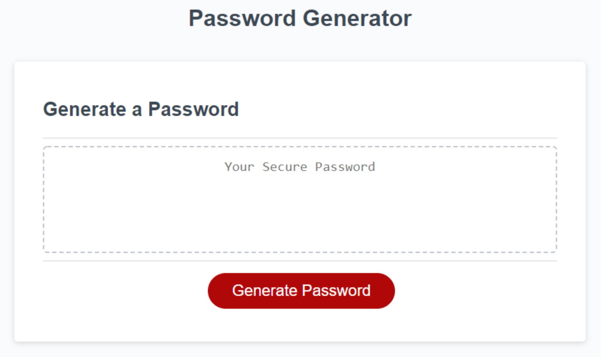

# Challenge3 Password Generator
Application that an employee can use to generate a random password based on criteria they’ve selected
 

## User Story

AS AN employee with access to sensitive data
I WANT to randomly generate a password that meets certain criteria
SO THAT I can create a strong password that provides greater security

## Acceptance Criteria
* Click the button to generate a password
* A series of prompts for password criteria
* Choose a length of at least 8 characters and no more than 128 characters
* Confirm whether or not to include lowercase, uppercase, numeric, and/or special characters
* Input should be validated and at least one character type should be selected
* A password is generated that matches the selected criteria
* The password is either displayed in an alert

## Assets

The following image demonstrates the web application's appearance and functionality:

